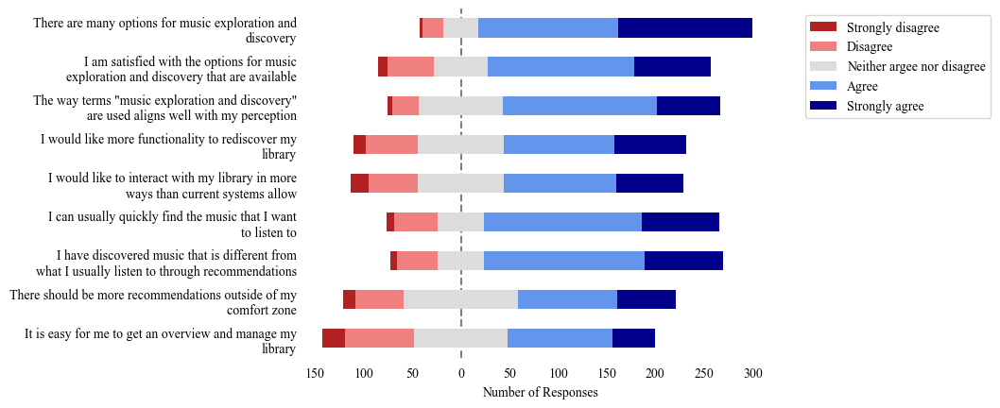

# Music Exploration Survey

This repository has the data and analysis scripts for the survey of music listening, exploration and discovery habits.
The survey was conducted via google forms between 2022/03/01 and 2022/03/15 with vonunteer participants recruited from Twitter, ISMIR mailing list, /r/samplesize and other social media.

- `data_public`
  - [`form_anon.tsv`](data_public/form_anon.tsv) - TSV file that contains 341 survey responses, exported from google sheet
  - [`questions.md`](data_public/questions.md) - questions that were used in the survey

# Results

The main question for the survey was to see the opinions on music discovery and rediscovery:


More figures are in [`figures`](figures) directory.

[Here](https://youtu.be/-b_CsR_WggM?t=540) (9:00--13:05) is the part of my PhD presentation that talks about the results of this survey.

# Run analysis

Requires Python 3.9+

```
python3.9 -m venv venv
source venv/bin/activate
pip install -r requrements.txt
python src/analyze.py data_public/form_anon.tsv figures --extension png
```

# Cite

This work is part of PhD thesis ["Exploration of Music Collections with Audio Embeddings"](http://hdl.handle.net/10803/675031).
```
@phdthesis{tovstogan_exploration_2022,
	author = {Tovstogan, Philip},
	title = {Exploration of music collections with audio embeddings},
	url = {http://hdl.handle.net/10803/675031},
	school = {Universitat Pompeu Fabra},
	year = {2022},
}
```

# License

* The code in this repository is licensed under [Apache 2.0](LICENSE)
* The survey data is licensed under a [CC BY 4.0](https://creativecommons.org/licenses/by/4.0/)

# Acknowledgements

This project has received funding from the European Union's Horizon 2020 research and innovation programme under the Marie Skłodowska-Curie grant agreement No. 765068.
